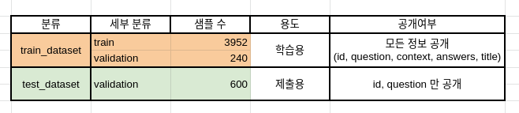

# Readme

## 소개

Open-Domain Question Answering (ODQA) 대회를 위한 베이스라인 코드 및 Roberta 실험 코드

## 설치 방법

### 요구 사항

```
# data (51.2 MB)
tar -xzf data.tar.gz

# 필요한 파이썬 패키지 설치. 
pip install -r requirements.txt
```

## 파일 구성


### 저장소 구조

```bash
../data/                 # 전체 데이터. 아래 상세 설명
./assets/                # readme 에 필요한 이미지 저장
./ensemble/              # hard, soft 등 Ensemble 코드
./log/                   # sh 실행 결과를 통해 얻은 log
./py/                    # 이전 실험에 사용한 코드
./sh/                    # 학습 파이프라인 코드
requirements.txt         # 요구사항 설치 파일
retrieval.py             # sparse retreiver 모듈 제공 
arguments.py             # 실행되는 모든 argument가 dataclass 의 형태로 저장되어있음
trainer_qa.py            # MRC 모델 학습에 필요한 trainer 제공.
utils_qa.py              # 기타 유틸 함수 제공 
run_final_last_tapt.sh   # 훈련-평가-추론
run_final_new_tapt.sh   # 훈련-평가-추론

upload_model.py          # HuggingFace 모델 업로드 제공
TAPT.py                  # TAPT 학습
train_roberta.py         # MRC, Retrieval 모델 학습 및 평가 
inference_llm.py         # ODQA 모델 평가 또는 제출 파일 생성
```

## 데이터 소개

아래는 제공하는 데이터셋의 분포를 보여줍니다.



데이터셋은 편의성을 위해 Huggingface 에서 제공하는 datasets를 이용하여 pyarrow 형식의 데이터로 저장되어있습니다. 다음은 데이터셋의 구성입니다.

```bash
../data/                        # 전체 데이터
    ./train_dataset/           # 학습에 사용할 데이터셋. train 과 validation 으로 구성 
    ./test_dataset/            # 제출에 사용될 데이터셋. validation 으로 구성 
    ./wikipedia_documents.json # 위키피디아 문서 집합. retrieval을 위해 쓰이는 corpus.
```

data에 대한 argument 는 `arguments.py` 의 `DataTrainingArguments` 에서 확인 가능합니다. 

# 훈련, 평가, 추론

```bash
chmod +x run_final_last_tapt.sh
nohup ./run_final_last_tapt.sh > logs~.txt 2>&1 &
```
  

  

  


  


  
  
   
  
  
  


  

  
